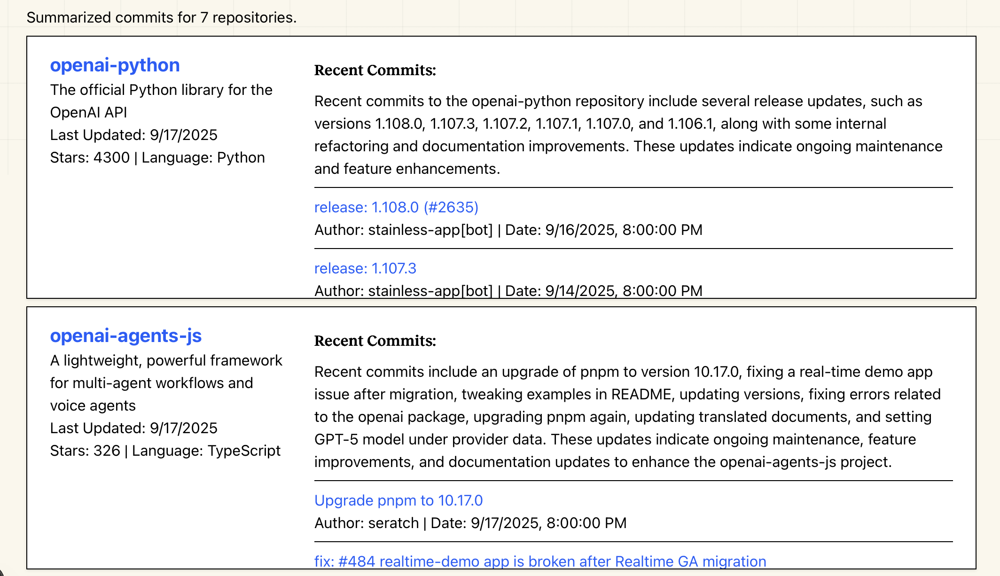

#  GitHub Activity Summarizer
### Powered by [Exa.ai](https://exa.ai) - The Search Engine for AI Applications

<br>

## 🎯 What is GitHub Activity Summarizer?

GitHub Activity Summarizer is a tool that helps you gain instant insights into what a company has been building. Just input the URL of a GitHub organization, and the tool live crawls the company's GitHub and summarizes the recently updated repos and commits for you, helping you cut through the noise and see the real progress in engineering -- so you can stay ahead of what matters most.

Example result for github.com/openai:



<br>

## 📊 Data Sources & API Endpoints
All data is fetched using Exa's powerful crawler. You can read more about the crawler API [here](https://docs.exa.ai/reference/get-contents), the TypeScript SDK [here](https://docs.exa.ai/sdks/typescript-sdk-specification#getcontents-method), and try it in the [playground](https://dashboard.exa.ai/playground/get-contents).

It is possible to also get this data from the GitHub API and process it with LLM, but I wanted to explore Exa's live crawlers for this project. I am pretty impressed with the performance and ease of use!

<br>

## 💻 Tech Stack
- **Crawling Engine**: [Exa.ai](https://exa.ai)
- **Frontend**: [Next.js](https://nextjs.org/docs) with App Router, [TailwindCSS](https://tailwindcss.com), TypeScript
- **Hosting**: [Vercel](https://vercel.com/)

<br>

## 🚀 Getting Started

### Prerequisites
- Node.js
- Exa.ai API key

### Installation

1. Clone the repository
```bash
git clone https://github.com/angihe93/github-activity-summarizer
cd github-activity-summarizer
```

2. Install dependencies
```bash
npm install
# or
yarn install
```

3. Set up .env by adding EXA_API_KEY as in .env.example.
* **Exa API Key**: Get from [Exa Dashboard](https://dashboard.exa.ai/api-keys)


4. Run the development server
```bash
npm run dev
# or
yarn dev
```

5. Open http://localhost:3000 in your browser

<br>

## Future Work
* Support processing of non-default branches of GitHub repos
* Improve data reliability, quality, and scope
* Allow customizations of activity time period, number of results to return, and other features

<br>

## ⭐ About [Exa.ai](https://exa.ai)

This project is powered by [Exa.ai](https://exa.ai), a powerful search engine and web search API designed specifically for AI applications. Exa provides:

* Advanced semantic search capabilities
* Clean web content extraction
* Real-time data retrieval
* Comprehensive web search functionality
* Superior search accuracy for AI applications

[Try Exa search](https://exa.ai/search)

<br>
